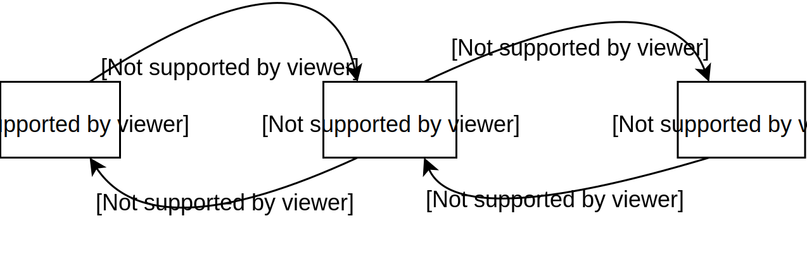

# accelo-state-machine

Yet another state-machine, but with a very nice 👩‍🍳💋 chaining api, with type saftey!

### How to use?

Given the example of a very simple state-machine managing the states of water.



#### JS example

```js
// import and call the initialiser to get our state machine plus some functions used for the api
import { stateMachineInitialiser } from './index';
const { acceloStateMachine, enters, addState, changeStateTo } = stateMachineInitialiser();

// now we define our states and the transitions out of each.
// The function we define in "transitioningFromItGiven" destructures booleans,
// At this point we can just focus on making sure they're namee well.
const states = [
    addState('ice').transitioningFromItGiven(({ isTemperatureAboveMelting }) =>
        changeStateTo('liquid')
            .when(isTemperatureAboveMelting)
            .decide()
    ),
    // In the case of liquid that can transition to more than one state, we chain .orTo to add more transitions
    // if multiple booleans are true the statemachine will transition to the first 
    // and if none are true it won't change state.
    addState('liquid').transitioningFromItGiven(({ isTemperatureAboveBoiling, isTemperatureBelowMelting }) =>
        changeStateTo('steam')
            .when(isTemperatureAboveBoiling)
            .orTo('ice')
            .when(isTemperatureBelowMelting)
            .decide()
    ),
    addState('steam').transitioningFromItGiven(({ isTemperatureBelowBoiling }) =>
        changeStateTo('liquid')
            .when(isTemperatureBelowBoiling)
            .decide()
    ),
];

// now we want to focus on how to define the booleans we destructured above.
// we're wrapping the updateStateMachine method in a function that only requires
// temperature to make updating the statemachine simple.
const stateMachineDigest(temperature) => {
    this.acceloStateMachine.updateStateMachine({
        isTemperatureAboveBoiling: temperature > 100,
        isTemperatureAboveMelting: temperature > 0,
        isTemperatureBelowBoiling: temperature <= 100,
        isTemperatureBelowMelting: temperature <= 0,
    });
};

// We define our subscriptions to state-machine events.
// We can use the "any" key word to listen to all events, as well as
// being more specific
subscriptions = [
    enters('any').run(() => console.log('every state change')),
    enters('ice').run(() => console.log('current state: ice')),
    enters('liquid').run(() => console.log('current state: liquid')),
    enters('steam').run(() => console.log('current state: steam')),
    enters('liquid')
        .from('steam')
        .run(() => console.log('transitioned from steam to liquid')),
];

// the setup takes the array of states, an inital state and the subscriptions.
acceloStateMachine.setup(states, 'liquid', subscriptions);

// now we can run the digest when ever something relevant changes (temperature in this case).
waterStateMachine.stateMachineDigest(-5); // 'every state change' + 'current state: ice'
waterStateMachine.stateMachineDigest(50); // 'every state change' + 'current state: liquid'
waterStateMachine.stateMachineDigest(150); // 'every state change' + 'current state: steam'
waterStateMachine.stateMachineDigest(-150); // 'every state change' + 'current state: liquid' + 'transitioned from steam to liquid'

// No state change so nothing will be run. There is no harm in running the digest extra times.
[-150, -150, -150, -150, -150].forEach((temperature) => waterStateMachine.stateMachineDigest(temperature))

```

#### TS example 😎

```ts
// Using TS to define our States, StateDetails (which should always look the same)
// and TransitionFactors, which is a bunch booleans, all the factors that could trigger a transition
export enum State {
	Ice = 'ice',
	Liquid = 'liquid',
	Steam = 'steam',
}

interface TransitionFactors {
    isTemperatureAboveBoiling: boolean;
    isTemperatureAboveMelting: boolean;
    isTemperatureBelowBoiling: boolean;
    isTemperatureBelowMelting: boolean;
}

interface StateDetails {
	stateName: State;
	transitionChecks(factors: TransitionFactors): State;
}

// import and call the initialiser with the types defined above to get our state machine
// plus some functions used for the api, useing these functions will now have type saftely too.
import { stateMachineInitialiser } from './index';
const { acceloStateMachine, enters, addState, changeStateTo } = stateMachineInitialiser<
	State,
	TransitionFactors,
	StateDetails
>();

// now we define our states and the transitions out of each.
// The function we define in "transitioningFromItGiven" destructures booleans from TransitionFactors,
const states = [
    addState(State.Ice).transitioningFromItGiven(({ isTemperatureAboveMelting }) =>
        changeStateTo(State.Liquid)
            .when(isTemperatureAboveMelting)
            .decide()
    ),
    // In the case of liquid that can transition to more than one state, we chain .orTo to add more transitions
    // if multiple booleans are true the statemachine will transition to the first 
    // and if none are true it won't change state.
    addState(State.Liquid).transitioningFromItGiven(({ isTemperatureAboveBoiling, isTemperatureBelowMelting }) =>
        changeStateTo(State.Steam)
            .when(isTemperatureAboveBoiling)
            .orTo(State.Ice)
            .when(isTemperatureBelowMelting)
            .decide()
    ),
    addState(State.Steam).transitioningFromItGiven(({ isTemperatureBelowBoiling }) =>
        changeStateTo(State.Liquid)
            .when(isTemperatureBelowBoiling)
            .decide()
    ),
];

// now we want to define the booleans we destructured above.
// we're wrapping the updateStateMachine method in a function that only requires
// temperature to make updating the statemachine simple.
const stateMachineDigest(temperature) => {
    this.acceloStateMachine.updateStateMachine({
        isTemperatureAboveBoiling: temperature > 100,
        isTemperatureAboveMelting: temperature > 0,
        isTemperatureBelowBoiling: temperature <= 100,
        isTemperatureBelowMelting: temperature <= 0,
    });
};

// We define our subscriptions to state-machine events.
// We can use the "any" key word to listen to all events, as well as
// being more specific
subscriptions = [
    enters('any').run(() => console.log('every state change')),
    enters(State.Ice).run(() => console.log('current state: ice')),
    enters(State.Liquid).run(() => console.log('current state: liquid')),
    enters(State.Steam).run(() => console.log('current state: steam')),
    enters(State.Liquid)
        .from(State.Steam)
        .run(() => console.log('transitioned from steam to liquid')),
];

// the setup takes the array of states, an inital state and the subscriptions.
acceloStateMachine.setup(states, State.Liquid, subscriptions);

// now we can run the digest when ever something relevant changes (temperature in this case).
waterStateMachine.stateMachineDigest(-5); // 'every state change' + 'current state: ice'
waterStateMachine.stateMachineDigest(50); // 'every state change' + 'current state: liquid'
waterStateMachine.stateMachineDigest(150); // 'every state change' + 'current state: steam'
waterStateMachine.stateMachineDigest(-150); // 'every state change' + 'current state: liquid' + 'transitioned from steam to liquid'

// No state change so nothing will be run. There is no harm in running the digest extra times.
[-150, -150, -150, -150, -150].forEach((temperature) => waterStateMachine.stateMachineDigest(temperature))

```
